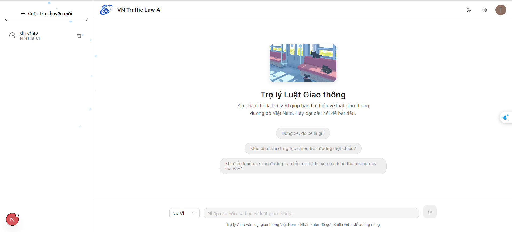

# ChatBot Luật Giao Thông Việt Nam 🚗

Hệ thống chatbot hỗ trợ tra cứu thông tin về Luật Giao thông đường bộ Việt Nam dựa trên mô hình **Retrieval-Augmented Generation (RAG)** nâng cao. Dự án này giúp người dùng dễ dàng tra cứu các quy định, mức phạt, và các vấn đề liên quan đến giao thông một cách nhanh chóng và chính xác.

---

## Bộ Dữ Liệu

Dữ liệu hệ thống được thu thập từ các nguồn chính thức về Luật Giao thông đường bộ Việt Nam, bao gồm:
- **Luật Giao thông đường bộ** (số 23/2008/QH12)
- **Nghị định quy định xử phạt vi phạm hành chính** trong lĩnh vực giao thông
- **Thông tư hướng dẫn** về đăng ký xe, bằng lái, biển số
- **Quy định về tốc độ, nồng độ cồn, thiết bị an toàn**

**Quy trình xử lý dữ liệu:**
- **Thu thập**: Crawl dữ liệu từ các nguồn chính thức (Cổng thông tin Chính phủ, Bộ GTVT)
- **Tiền xử lý**: Chuẩn hóa định dạng văn bản, chuyển đổi từ PDF/HTML sang plain text
- **Semantic Chunking**: Chia tài liệu thành các đoạn có ý nghĩa để cải thiện chất lượng truy xuất

---

## Tổng Quan Kiến Trúc

Hệ thống sử dụng kiến trúc **Advanced RAG** với ba giai đoạn chính:

### Sơ đồ Kiến Trúc Hệ Thống


### Các Thành Phần Chính

**1. Indexing Phase (Đánh Chỉ Mục)**
- **Load Data**: Tải dữ liệu từ các nguồn văn bản luật
- **Chunking**: Chia tài liệu thành các đoạn nhỏ có ý nghĩa
- **Embedding Generation**: Chuyển đổi text thành vector representation
- **Vector Database (Qdrant)**: Lưu trữ và quản lý vectors

**2. Retrieval Phase (Truy Xuất)**
- **Query Transform**: Tối ưu hóa truy vấn dựa trên lịch sử hội thoại
- **Query Router**: Phân loại loại truy vấn (luật, hỏi đáp, small talk)
- **Hybrid Search**: Kết hợp BM25 (keyword) và Semantic Search
- **Context Smoothing**: Hợp nhất các chunks liên quan

**3. Generation Phase (Sinh Câu Trả Lời)**
- **LLM (Gemini)**: Sử dụng Google Gemini để sinh câu trả lời
- **Chain-of-Thought Prompting**: Lý luận từng bước
- **Post-processing**: Định dạng và trích dẫn nguồn

---

## Stack Công Nghệ

### Backend
| Công nghệ | Mục đích |
|-----------|----------|
| Python + FastAPI | API Server |
| SentenceTransformer | Embedding Model |
| Qdrant | Vector Database |
| BM25 | Keyword Search |
| Google Gemini | Large Language Model |

### Frontend
| Công nghệ | Mục đích |
|-----------|----------|
| Next.js 16 | React Framework |
| TypeScript | Type-safe JavaScript |
| Ant Design | UI Components |
| Clerk | Authentication |
| Prisma + PostgreSQL | Database ORM |

---

## Cấu Trúc Dự Án

```
Chatbot4vnmtraffic/
├── fe/                           # Frontend Next.js
│   ├── src/
│   │   ├── app/                  # Next.js App Router
│   │   ├── components/           # React Components
│   │   └── lib/                  # Utilities
│   ├── prisma/                   # Database Schema
│   └── public/                   # Static Assets
├── Chatbot4vnmtraffic/
│   └── Source/                   # Backend Python
│       ├── main.py               # FastAPI Entry Point
│       ├── chat.py               # Chat Logic & LLM
│       ├── retriever.py          # RAG Retriever
│       ├── smooth_context.py     # Context Processing
│       └── data/                 # Data & Embeddings
├── image/                        # Documentation Images
└── requirement.txt               # Python Dependencies
```

---

## Giao Diện Người Dùng



### Tính Năng Giao Diện
- 📝 **Sidebar Navigation**: Quản lý các cuộc trò chuyện
- 💬 **Main Chat Area**: Hiển thị cuộc trò chuyện rõ ràng
- 🌙 **Theme Toggle**: Hỗ trợ chế độ sáng/tối
- 🌐 **Đa ngôn ngữ**: Tiếng Việt & Tiếng Anh
- 📚 **Trích dẫn nguồn**: Hiển thị nguồn thông tin

---

## Cài Đặt & Chạy

### Yêu Cầu Hệ Thống
- Python 3.10+
- Node.js 18+
- PostgreSQL (cho chat history)

### 1. Backend Setup

```bash
# Clone repository
git clone https://github.com/your-repo/Chatbot4vnmtraffic.git
cd Chatbot4vnmtraffic

# Tạo virtual environment
python -m venv venv
source venv/bin/activate  # Linux/Mac
# hoặc: venv\Scripts\activate  # Windows

# Cài đặt dependencies
pip install -r requirement.txt

# Cấu hình environment
cd Chatbot4vnmtraffic/Source
cp .env.example .env
# Chỉnh sửa .env với API keys

# Chạy backend server
python main.py
```

Backend sẽ chạy tại: `http://localhost:8000`

### 2. Frontend Setup

```bash
cd fe
npm install
npm run dev
```

Frontend sẽ chạy tại: `http://localhost:3000`

> 📖 Xem chi tiết hướng dẫn Frontend tại [fe/README.md](fe/README.md)

---

## Tính Năng Chính

| Tính năng | Mô tả |
|-----------|-------|
| 🔍 **Tra cứu Luật GT** | Tìm kiếm nhanh các quy định, mức phạt |
| 💬 **Hỏi đáp tương tác** | Hội thoại liên tục với context |
| 📜 **Lịch sử trò chuyện** | Lưu và quản lý conversations |
| 🎯 **Hybrid Search** | Kết hợp keyword + semantic search |
| 📎 **Trích dẫn nguồn** | Cung cấp điều luật tham chiếu |
| 🧠 **Context Window** | Nhớ 5 tin nhắn gần nhất |

---

## Đánh Giá Hiệu Suất

### Kết quả đánh giá các mô hình Embedding

| Model | Giai đoạn | Hit-Rate @10 | MRR @10 | MAP @10 |
|-------|-----------|--------------|---------|---------|
| Halong_embedding | Trước finetune | 0.9110 | 0.8497 | 0.6721 |
| Halong_embedding | Sau finetune | 0.9349 | 0.8386 | 0.6862 |
| Vietnamese PhoBERT | Trước finetune | 0.9110 | 0.8209 | 0.6358 |
| Vietnamese PhoBERT | Sau finetune | 0.9212 | 0.8121 | 0.6540 |

---

## API Endpoints

| Method | Endpoint | Mô tả |
|--------|----------|-------|
| POST | `/messages` | Gửi tin nhắn và nhận phản hồi |
| GET | `/health` | Health check |

---

## Contributor

Dự án được phát triển bởi sinh viên UIT - Đại học Công nghệ Thông tin.

---

## License

MIT License - Xem file [LICENSE](LICENSE) để biết thêm chi tiết.
